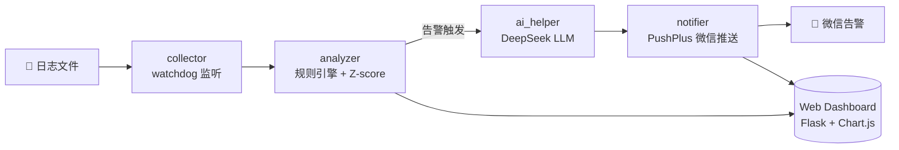

# 🔍 LogGuardian — 轻量级日志监控 + AI 辅助告警系统

<p align="center">
  
  
  
  
  
  
  
</p>

<p align="center">
  <b>实时日志采集 → 双引擎分析 → AI 根因诊断 → 微信推送 → Web Dashboard</b>
  <br>
  为中小型服务打造的端到端日志监控解决方案
</p>

---

## 📖 概述

LogGuardian 是一个**端到端的日志监控与智能告警系统**，专为中小型服务设计。它通过实时采集日志文件，结合 **规则引擎 + 统计异常检测** 双引擎分析，并引入 **DeepSeek 大模型** 进行根因分析和排查建议，最后通过 **微信推送** 通知运维人员，同时提供 **Web Dashboard** 可视化展示。

### 项目亮点

- 🔥 **双引擎告警**：规则引擎（快、准、可解释）+ 统计异常（发现未知模式）
- 🤖 **AI 增强运维**：调用 DeepSeek API 对异常日志进行语义分析，输出结构化 JSON 建议
- 📦 **工程化**：Docker 容器化部署，使用 `.env` 管理配置
- 📊 **实时 Dashboard**：Flask + Chart.js 展示告警趋势与详情

---

## 🧱 系统架构（数据流）



| 模块 | 职责 |
|------|------|
| **collector** | 使用 `watchdog` 实时监听日志文件变化，增量读取，自动检测编码 |
| **analyzer** | 规则引擎（正则匹配 ERROR/5xx/timeout）+ 滑动窗口 Z-score 统计异常检测 |
| **ai_helper** | 调用 DeepSeek API，输出 JSON 格式的可能原因和排查建议 |
| **notifier** | 通过 PushPlus 推送到个人微信 |
| **web** | Flask 提供 RESTful API，前端 Chart.js 展示告警趋势，表格展示详情 |

---

## ✨ 核心功能

| 功能 | 说明 |
|------|------|
| 📥 **日志采集** | 实时监控文件变化，增量读取，支持日志轮转，自动检测文件编码 |
| ⚡ **规则引擎** | 基于正则匹配 ERROR、5xx、timeout 等关键词，毫秒级响应 |
| 📈 **统计异常检测** | 滑动窗口 Z-score，发现突发错误流量或模式偏移 |
| 🧠 **AI 根因分析** | DeepSeek API 分析异常日志，输出结构化诊断与建议 |
| 📱 **微信推送** | 通过 PushPlus 将告警消息（含 AI 建议）推送到个人微信 |
| 📊 **Web Dashboard** | 实时告警列表、趋势折线图、统计卡片，每 3 秒自动刷新 |
| 🐳 **容器化部署** | Docker + docker-compose 一键构建运行 |

---

## 🛠 技术栈

| 类别 | 技术 |
|------|------|
| 🐍 **语言** | Python 3.10+ |
| 👀 **日志采集** | [watchdog](https://github.com/gorakhargosh/watchdog) |
| 🌐 **Web 框架** | [Flask](https://flask.palletsprojects.com/) |
| 📈 **前端图表** | [Chart.js](https://www.chartjs.org/)（CDN） |
| 🧠 **大模型** | [DeepSeek Chat API](https://platform.deepseek.com/)（兼容 OpenAI SDK） |
| 💬 **消息推送** | [PushPlus](https://www.pushplus.plus/)（微信） |
| ⚙️ **配置管理** | [python-dotenv](https://github.com/theskumar/python-dotenv) |
| 🐳 **容器化** | Docker, docker-compose |

---

## 🚀 快速开始

### 前置要求

- Python 3.10+
- [DeepSeek API Key](https://platform.deepseek.com/)（[注册获取](https://platform.deepseek.com/sign_up)）
- [PushPlus Token](https://www.pushplus.plus/)（用于微信推送）

### 1. 克隆项目

```bash
git clone https://github.com/sinonTime/log-guardian.git
cd log-guardian
```

### 2. 创建虚拟环境并安装依赖

```bash
python -m venv venv

# Windows
venv\Scripts\activate
# Linux/macOS
source venv/bin/activate

pip install -r requirements.txt
```

### 3. 配置环境变量

创建 `.env` 文件（与 `docker-compose.yml` 同级）：

```ini
DEEPSEEK_API_KEY=sk-你的DeepSeek密钥
PUSHPLUS_TOKEN=你的PushPlus Token
LOG_FILE=test.log
```

> **💡 提示**：
> - DeepSeek API Key 在 [platform.deepseek.com](https://platform.deepseek.com/) 注册获取，新用户有免费额度
> - PushPlus Token 在 [pushplus.plus](https://www.pushplus.plus/) 登录后 → 一对一推送 → 获取 Token
> - 如果不需要 AI 分析，可以不配 `DEEPSEEK_API_KEY`，系统会跳过 AI 步骤

### 4. 运行系统

```bash
python main.py
```

打开浏览器访问 **http://localhost:5000** 查看 Dashboard。

### 5. 模拟触发告警

打开另一个终端，模拟产生异常日志：

```bash
echo "ERROR: database connection timeout" >> test.log
```

观察主终端输出，你将看到完整的处理链路：

```
[采集到新日志] ERROR: database connection timeout
[分析结果] {'alert': True, 'engine': 'rule', ...}
[AI分析] 可能原因: ...
[通知] 微信推送已发送
```

同时微信将收到包含 AI 建议的告警消息，Dashboard 页面也会实时更新。

---

## 🐳 Docker 部署

### 构建并启动

```bash
docker compose up --build
```

### 配置环境变量

确保 `.env` 文件已正确设置，或通过 shell 传入：

```bash
DEEPSEEK_API_KEY=sk-xxx PUSHPLUS_TOKEN=xxx docker compose up
```

### 访问 Dashboard

浏览器打开 **http://localhost:5000**。

> **📌 注意**：容器内的日志文件路径默认挂载了宿主机的 `/var/log/nginx`。如需监控其他文件，请修改 `docker-compose.yml` 中的 `volumes` 配置。

---

## 📁 项目结构

```
log-guardian/
├── collector/
│   ├── __init__.py
│   └── log_watcher.py          # watchdog 日志文件监听
├── analyzer/
│   ├── __init__.py              # Analyzer 类，组合规则+统计引擎
│   ├── rule_engine.py           # 规则引擎（正则匹配）
│   └── anomaly_detector.py      # 滑动窗口 Z-score 异常检测
├── notifier/
│   ├── __init__.py              # 统一通知接口
│   └── wechat_notifier.py       # PushPlus 微信推送
├── ai_helper/
│   ├── __init__.py
│   └── llm_client.py            # DeepSeek API 调用与 Prompt 设计
├── web/
│   ├── __init__.py
│   ├── app.py                   # Flask 服务 + REST API
│   └── templates/
│       └── index.html           # Dashboard 前端页面
├── main.py                      # 系统主入口，串联所有模块
├── requirements.txt             # Python 依赖
├── .env                         # 环境变量（Git 忽略）
├── Dockerfile                   # 容器构建文件
├── docker-compose.yml           # 多容器编排
└── README.md                    # 项目文档
```

---

## 💡 关键设计

### 1. 双引擎告警

| 引擎 | 特点 | 适用场景 |
|------|------|---------|
| **规则引擎** | 快速、确定、可解释 | 覆盖已知异常模式（ERROR/5xx/timeout） |
| **统计异常** | 滑动窗口 Z-score，自适应 | 检测突发错误流量、未知模式偏移 |

两个引擎并行工作，任一引擎触发即告警，**降低漏报风险**。

### 2. AI Prompt 工程

- 设计严格格式的提示词，要求模型输出固定的 JSON 字段（`possible_cause`, `suggestion`）
- 使用 `temperature=0.1` 降低输出随机性
- 处理模型可能返回的 Markdown 代码块（`` ```json ``），提高解析成功率
- 调用失败时自动降级，不影响主告警流程

### 3. Windows 兼容性

- 通过 `os.path.abspath` 统一路径表示
- 保留轮询模式作为备选，确保跨平台稳定性

### 4. 异常处理

- 每个模块都包裹了 try-except 防止单点故障导致系统崩溃
- AI 分析失败时自动降级，不影响告警主流程

---
## 🔮 扩展思路

- 💾 **持久化存储**：将告警存入 SQLite / PostgreSQL，支持历史查询
- 📨 **多通道通知**：增加企业微信、钉钉、邮件等
- 🔗 **告警聚合**：相同错误合并，减少重复推送
- 📐 **更丰富的异常检测**：引入 Isolation Forest、Prophet 等模型
- 📂 **日志文件自动发现**：监听目录下所有 `.log` 文件
- 📡 **集成 Prometheus**：暴露指标供 Prometheus 拉取

---

## 🤝 贡献

欢迎 Issues、PRs、Star！如果你有好的想法或发现了 bug，欢迎：

1. Fork 本仓库
2. 创建你的特性分支 (`git checkout -b feature/amazing-feature`)
3. 提交你的改动 (`git commit -m 'feat: add amazing feature'`)
4. 推送到分支 (`git push origin feature/amazing-feature`)
5. 提交 Pull Request

---

## 📄 License

[MIT](LICENSE) © 2024 SinonTime

---

## 👨‍💻 关于作者

**SinonTime** — 全栈开发者 & 运维爱好者

- 🌐 GitHub: [@sinonTime](https://github.com/sinonTime)
- 📧 Email: 2392295434@qq.com

> 如果这个项目对你有帮助，请给一个 ⭐️ 吧！
